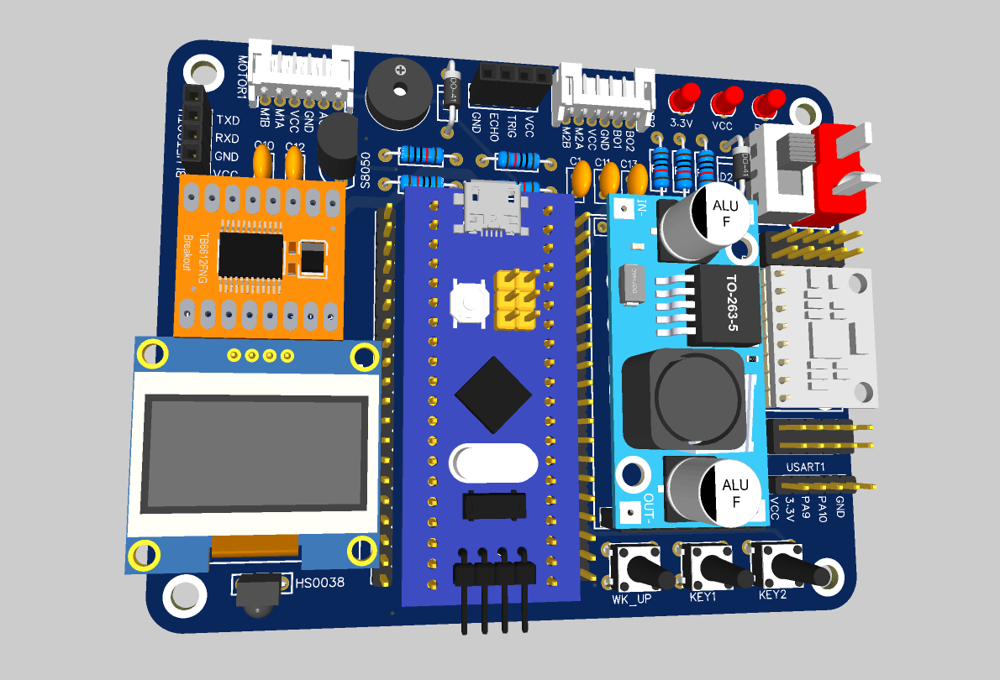

# Mini-Balance

[视频链接](https://www.bilibili.com/video/BV1aL411b77S/)

基于 STM32C8T6 单片机，HAL 库 + CubeMX 极速开发，PCB 模块化设计，嘉立创打板，平衡小车之家底盘，采用 MPU6050、超声波 HC-SR04 等传感器，集合 HC-05 蓝牙模块，使用 PID 控制算法，0.96 寸 OLED 屏实时显示小车运行状态，一款可通过手机蓝牙灵活控制，集避障、跟随于一体的智能平衡小车。

